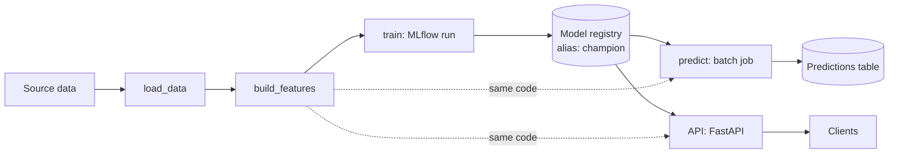

# System design

Page 0 of the project architecture. The default design is filled in; edit the
parts that differ for your project and complete the table at the bottom.

## Data flow

`build_features`, `load_champion` and `score` are the only places features are
built and records are produced. Training, batch scoring and the API all call
them, so there is no train/serve skew and the output schema
(`PredictionRecord`) is the same everywhere.

## Environments

| `CORNERSTONE_ENV` | Where | MLflow | Registry | Predictions |
| :-- | :-- | :-- | :-- | :-- |
| `local` | laptop | sqlite file | sqlite file | local parquet |
| `dev` / `staging` / `prod` | Databricks | Databricks | Unity Catalog `ml_<env>.ds_template.model` | UC Volume |

The only difference between environments is config in `src/configs/`; no code
branches on the platform. Local runs need no Databricks account. Deploying to
Databricks is `databricks bundle deploy -t <env>`.

## Batch vs online

Batch is the default: the `predict` job writes a predictions table on a schedule.
Add the API only when a consumer needs per-request latency. Both read the model
through the same alias.

## Promotion and rollback

1. `ds-template train` logs a run and registers a new model version.
2. Evaluate the new version against the current champion on the locked test set.
3. `ds-template promote --version N` points the `champion` alias at it.

Rollback is the same command with the previous version number. Batch jobs pick
up the new alias on their next run. The API loads the model at startup, so
restart or redeploy it after promoting.

## Retraining trigger

State this per project. Default: a schedule, plus retrain when
`monitoring.drift.feature_drift_report` shows PSI above threshold on live inputs
versus the training data.

## Monitoring

- Prediction score distribution over time.
- Feature drift (`src/monitoring/drift.py`).
- Upstream row counts and null rates, checked before blaming the model.

## Project fill-in

| Question | Answer |
| :-- | :-- |
| Decision the model supports | |
| Metric that matters, and why | |
| Latency requirement (batch / online) | |
| Data freshness | |
| Retraining trigger | |
| Owner and on-call | |
